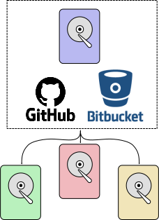

### Who Uses Git?
Git is a common version control system used in academia and industry to keep track of changes to code either when working individually or on a team. The power of git is its use of a centralized repository that is the main, ground truth of the code and individuals can pull their code from this central repository to make changes and push their local changes to this central repository.

  

### How Does Git Work?
Git tracks all of the changes to a set of code in "commits". Commits are essentially points in time where you wanted to save the changes you have made. These commits are recorded as a history where you can go back to any of the times you committed changes. You can also have a branching commit history if you want to try multiple things at once or add features to your code without affecting the main code you want to use day to day. Different teams can also work on different features or fixes to the main code and merge it all back together for the production ready code. You can also "tag" specific points in your code as important releases that you can go back to if new features are not working. Saving changes like this instead of as multiple files allows for cleaner code and a much easier way to document how your code was made when passing it on to someone else.

  

### Where Does the Central Repository Go?
You can set a hard drive as a central repository, but that can be difficult for a team to use especially when remote. For this reason, most people use repository hosting websites. One of the most used repository hosting sites is GitHub. In fact, the code that generates this website is stored on GitHub. It is popular due to its robust toolset, the fact that it is free, and you can host private repsoitories of your code for free. I would also encourage you to sync between multiple repositories just in case GitHub goes down one day and especially if you need to back up your code in other areas than your hard drive. My personal method is using GitHub, Bitbucket, and an external hard drive as three central repositories with identical copies of the same code I am working on. I will go over how to set up a command that will push code to multiple repositories simultaneously in a later post.

  

### How Do You Use Git?
There are two main methods of using git, through the command line and from a desktop GUI. Both have their merits and I will go over them in some more detail in their own sections. My personal preference is the command line as it gives me much more control over what I am doing, but it does also require more memorization of commands. Desktop GUIs are much easier to use when making small changes and pushing those changes to your central repository, but making custom commands to take care of larger and more common tasks is not as easy. Finally, regardless of how small you think your code is, it is always a good idea to track your changes with git from the beginning. You never know when someone else will need part of the code you made or if you will need to go back to a specific point in time before you made a change.

### Learning to Use Git
A basic graphical walkthrough is located at [Learn Git Branching](https://learngitbranching.js.org/) Learn Git Branching is especially helpful as it walks you through how all of the basics work and gives you a visual example of what the commands are doing in the code history. The [git handbook](https://git-scm.com/book/en/v2) is also a good resource for learning how git works and the commands you can use, but it does go into much more detail than you will likely need. [GitHub](https://guides.github.com/introduction/git-handbook/) and [Bitbucket](https://www.atlassian.com/git/tutorials/learn-git-with-bitbucket-cloud) have much simpler guides that I would suggest as well.
